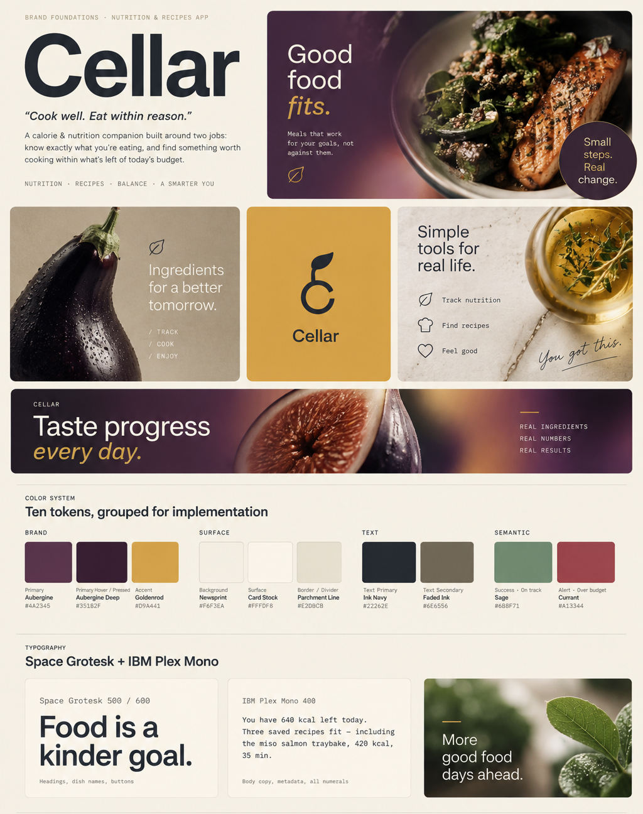
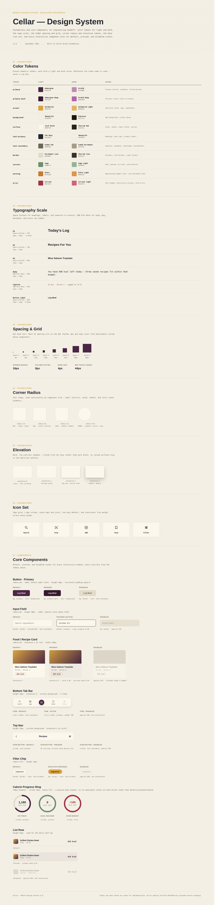
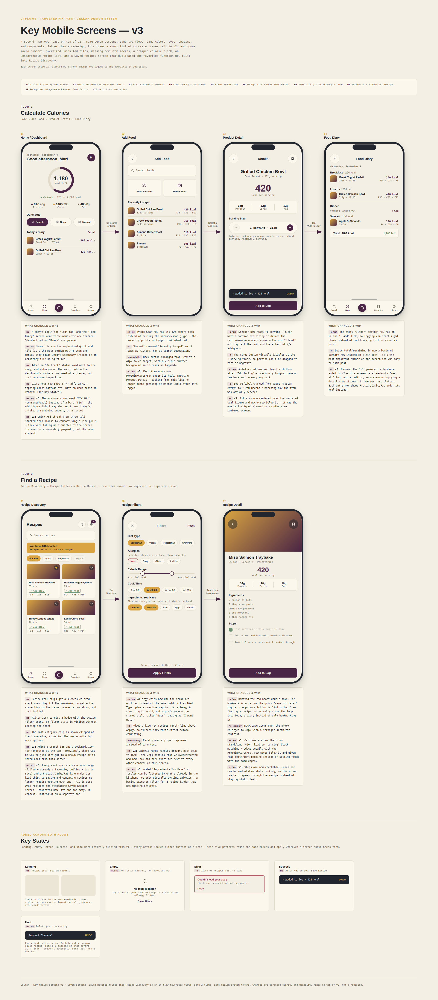

# Cellar — Calorie & Nutrition App

Cellar is an MVP concept for a mobile nutrition app focused on two core tasks: tracking calories and macros, and finding recipes that fit the user's preferences and daily goals.

**Video walkthrough:** [ADD LINK]

The project was created through an AI-native workflow using Claude Code — from visual exploration and the design system to key user flows and UX iterations.

---

## 1. Brand Direction

Cellar moves away from the typical green-and-white visual language of nutrition apps.

The identity combines deep aubergine, warm goldenrod and soft neutral surfaces to create a more mature, food-focused experience without visually labeling choices as “healthy” or “unhealthy.”

**Space Grotesk** creates a clear and approachable hierarchy, while **IBM Plex Mono** gives nutritional values and metadata a structured, data-driven feel.

The result is intended to feel closer to a modern food editorial product than a traditional calorie counter.



---

## 2. Design System

The visual direction was translated into a reusable mobile design system covering typography, color, spacing, elevation, icons and core UI components.

The system supports both light and dark modes and keeps nutritional data, actions and navigation consistent across the product.

### Core foundations

- 4pt spacing system
- 44px minimum touch targets
- Light and dark color tokens
- Reusable navigation, inputs, cards, filters and buttons
- Dedicated states for progress, feedback and system status



### Design Tokens

```
# Cellar Design Tokens

## Colors — Light Mode

Primary (Aubergine): #4A2545
Primary Dark (Aubergine Deep): #35192F
Accent (Goldenrod): #D9A441
Background (Newsprint): #F3EFE4
Surface (Card Stock): #FBF7EC
Text Primary (Ink Navy): #22262E
Text Secondary (Faded Ink): #6E6656
Border (Parchment Line): #E2DBC9
Success (Sage): #6B8F71
Warning (Ochre): #C97A2B
Error (Currant): #A13344

## Colors — Dark Mode

Primary (Orchid): #C18BB9
Primary Dark (Orchid Deep): #B464AA
Accent (Goldenrod Light): #E0B563
Background (Espresso): #1C1712
Surface (Charred Oak): #2A231C
Text Primary (Newsprint): #F3EFE4
Text Secondary (Faded Parchment): #A79C87
Border (Charred Line): #3A322A
Success (Sage Light): #8FB694
Warning (Ochre Light): #E0954C
Error (Currant Light): #D1637A

## Fonts

Heading: Space Grotesk — weights 500, 600, 700
Body: IBM Plex Mono — weights 400, 500, 600

H1: Space Grotesk 700, 28px, line-height 36px, letter-spacing -0.01em
H2: Space Grotesk 700, 22px, line-height 28px
H3: Space Grotesk 600, 17px, line-height 22px
Body: IBM Plex Mono 400, 15px, line-height 22px
Caption: IBM Plex Mono 400, 12px, line-height 16px
Button Label: Space Grotesk 600, 14px, line-height 20px, letter-spacing 0.02em

## Spacing (Indents)

space-1: 4px
space-2: 8px
space-3: 12px
space-4: 16px
space-5: 24px
space-6: 32px
space-7: 48px
space-8: 64px

Screen margin: 16px
Column gutter: 8px
Base unit: 4px
Min touch target: 44px

```

---

## 3. Core User Flows

The MVP focuses only on the two main user journeys required for the task.

**Flow 1 — Track Food**  
Home → Add Food → Product Detail → Food Diary

Users can understand their daily calorie and macro progress, find or scan food, adjust portions and add products to their diary.

**Flow 2 — Find a Recipe**  
Recipe Discovery → Filters → Recipe Detail

Users can explore recipes based on their remaining calorie budget, filter them by dietary preferences and available ingredients, save favorites and follow cooking steps.

These screens should be treated as the foundation of a product rather than a complete production-ready application.



---

## UX Iteration

The first version was reviewed against Jakob Nielsen's usability heuristics and then refined through a focused UX pass.

The main improvements included clearer consumed-vs-goal nutrition values, more compact actions, visible macros on food and recipe cards, simplified navigation, recipe search and favorites, better filters, and checkable cooking steps.

The goal was not to redesign the concept, but to remove unnecessary friction from the two main flows.

---

## Process & Prompts

Claude Code was used throughout the project as an active design tool rather than only for final execution.

The workflow followed a simple cycle:

**Explore → Generate → Review → Identify UX issues → Refine**

The prompt history below documents the main iterations used to develop the brand, design system and final screens.

```
1/I'm designing a mobile app called a calorie & nutrition calculator (working name TBD — propose 3 short, memorable name options as part of this). Two core user stories it must support: 1) Calculate the calories in a dish or a specific food product. 2) Find a recipe that suits the user's diet and remaining calorie budget. Create 3 distinct branding / stylescape directions for this app. For each direction show, on its own artboard: - A proposed app name + one-line personality statement - A color palette with 5-6 named hex swatches (primary, secondary/accent, background, surface, text, one semantic color) - Typography: a heading + body font pairing rendered as real type specimens - App icon concept - 2-3 sample UI fragments in that style (a button, a stat chip showing "420 kcal", a small card) - A short rationale for why it fits a nutrition/calorie-tracking app Keep the 3 directions genuinely different — avoid generic "healthy app" clichés (mint green + white, cream + terracotta). All text in English.

2/Direction Larder is the one I'm moving forward with but use typogragraphy from Calx. Refine it further: finalize the app name, tighten the palette to exactly the tokens I'll need for a design system, and confirm the font pairing. All in English.

3/As a result, I want to get a beautifully composed visual board for a presentation

```

**Design System**

```
Using the branding direction we just finalized, build a complete mobile design system as one labeled reference canvas. Include: - Color tokens (primary, primary-dark, accent, background, surface, text-primary, text-secondary, border, success/warning/error) for light and dark mode - Typography scale: H1, H2, H3, Body, Caption, Button label — real sizes and weights - Spacing/grid (4/8pt scale), corner-radius tokens, shadow levels - Icon set (search, scan/camera, add, save, filter) - Core components with states (default/pressed/disabled): buttons, input, food/recipe card, bottom tab bar, top nav, filter chip, calorie progress ring, list row Lay it out like a real developer-facing spec sheet. All text in English.

output tokens (colors/fonts/indents) in plain text — to paste it into tokens.md
```

**Key Screens**

```
1/Now design the key mobile screens using the design system above (iPhone frame, 375x812), covering both flows on one connected canvas with arrows showing navigation: Flow 1 — Calculate calories: 1. Home/Dashboard — calorie/macro summary, quick-add 2. Add Food — search, recent items, barcode/photo-scan entry points 3. Product Detail — calories, macros, portion selector, "Add to log" 4. Food Diary — entries by meal, running totals Flow 2 — Find a recipe: 5. Recipe Discovery — recommendations based on remaining calories, categories 6. Recipe Filters — diet type, allergies, calorie range, cook time 7. Recipe Detail — image, calories/macros, ingredients, steps, save 8. Saved Recipes Reuse the exact colors, type scale and components — don't invent new styles. All UI text in English.

2/Improve their usability while preserving the existing Celler Design System, visual style, and two user flows.
Apply Jakob Nielsen’s 10 usability heuristics. Focus on the actual issues visible in the screens: small typography, weak visual hierarchy, ambiguous icons and navigation, unclear serving/calorie information, and insufficient feedback after user actions.
Improve the following:

Make primary actions and important information easier to scan.
Clarify food portions, calories per serving, and daily calorie progress.
Make search, filters, saving recipes, and adding food more intuitive.
Ensure consistent navigation, terminology, components, and button states.
Add appropriate loading, empty, error, success, and undo states.
Prevent incorrect food logging and make actions easy to reverse.
Improve accessibility, touch targets, and text contrast.
Keep all eight screens and the existing design language. Do not add unnecessary features or redesign the app from scratch.
For each screen, briefly explain what should be changed, why, and which Nielsen heuristic it addresses. Prioritize practical UX improvements over purely visual changes.

3/Let’s make only the most obvious and necessary improvements to each screen, without redesigning everything from scratch. Keep the existing visual style and design system, but apply visible UX fixes screen by screen.
Flow 1
Home screen

The protein, fat, and carbs section is unclear right now. It is not obvious whether these numbers show consumed values, remaining values, or daily goals.
Fix this by showing them in a clearer format, for example: Protein 21/85, Carbs 140/220, Fat 48/70, so it is obvious that this is the amount consumed out of the daily target.
Reduce the size of the quick add buttons. They do not need to take up so much space. Make them feel more like compact actions instead of half-screen blocks.
Add Food screen

For each food item, add protein, fat, and carbs under the calorie information, so users can immediately see the nutritional breakdown.
Product Detail screen

Center the product title. Right now it feels visually inconsistent because it is aligned to the left while the rest of the content is more centered.
Food Diary screen

If this screen acts like a “see all” state, simplify it.
Under the calories for each food card, add protein, fat, and carbs.
Remove the button or icon for opening the card if it is unnecessary. It adds clutter and does not seem useful here.
Flow 2
Recipe Discovery screen

Add a search option.
Add access to favorites.
On each recipe card, add the ability to save the recipe to favorites directly.
Also show protein, fat, and carbs on each card near the calories, so users can compare recipes more easily at a glance.
Recipe Filters screen

Make the calorie range slider handles smaller — the current circles are too large.
Add an area where users can choose basic ingredients they already have at home, so recipes can be filtered based on available products.
Recipe Detail screen

Make sure the calories/serving block does not feel cramped or pressed against the container edges.
Consider separating the calorie information into a clearer standalone block if needed.
Add the ability to check off steps as the user completes them, so they do not get lost while cooking.
Saved Recipes screen

Remove this screen entirely.
General direction

Focus on strong, visible fixes only.
Make the interface clearer, more practical, and more informative.
Improve usability and clarity in line with Nielsen’s usability heuristics.
Keep the structure recognizable, but fix the obvious UI/UX issues.
```
